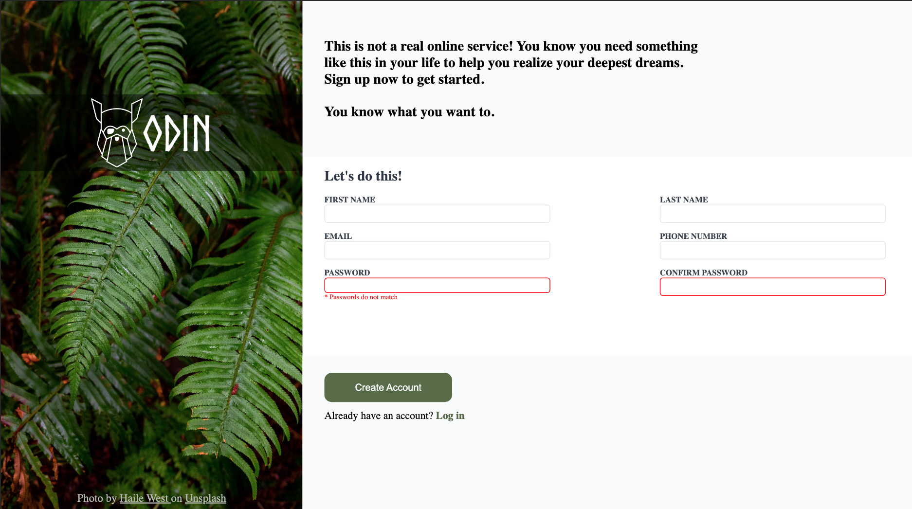

# Sign-up-Form

Intermediate-Odin project

## Introduction

Welcome to the Sign-up Form project, part of the Intermediate HTML and CSS Course. This project provides an opportunity for me to apply the knowledge gained from recent lessons by creating a sign-up form for an imaginary service.

Sign-up Form project created with HTML, CSS and Javascript.

## Getting Started

To get started with the game in your web browser, follow these instructions:

## Prerequisites

You need a modern web browser that supports HTML and CSS.

## Installation

Clone this repository to your local machine or download the ZIP file and extract it to a local folder. Open the index.html file in your web browser.
